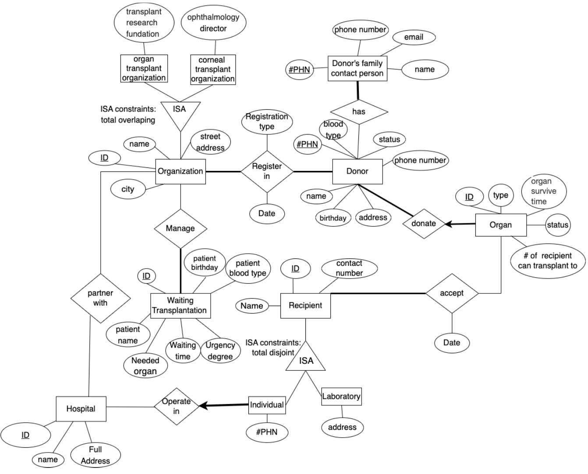

ER Diagram 

Comments:
#PHN: personal health number, it is unique for each person.
Status attributes of Donor: alive/pass away 
Status attributes of Organ: available/ unavailable
Some organs like the corneal can be transplanted to more than one recipient, so we decided to use many to many relationships between Organ and Recipient.
We choose to divide organizations into two different subclasses using ISA because some organizations only manage corneal tissue transplantation (eg: BC Eye Bank) which is separated from other organs. We choose to use “Organ” as the entity name which is general and contains all organs that can be transplanted including corneal.

Changes of ER Diagram from Milestone 1:
Combine Organ Type and Organ into one entity because type can be an attribute of each organ and it is more reasonable to combine them into one instead of separating them. 
Add ID as key for Organization and Hospital entity since two organizations or hospitals could have the same name. It is better to manage them uniquely with an ID.
Rename the “transform information” relationship between Hospital and Organization to “partner with” which is more reasonable and makes more sense.
We add different attributes to organ transplant organization and corneal transplant organization to show their difference and make our ISA make more sense when we transfer to the relation table. Some organizations only manage corneal tissue transplantation.
We changed the “Operat In” relationship to connect Hospital entity and subclass Individual entity instead of connecting to Recipient superclass which we did before, since it is not reasonable to make laboratory recipients operate in hospitals.

Schema & Functional Dependencies:
We use underline to represent Primary Key(PK) and bolded words for Foreign Key(FK) for each table. We will specify any Candidate Key(CK). Other constraints like UNIQUE and NOT NULL we will specify in DDL later. We put the FDs for each table just below that table for convenience. 

1. Organization(organizationID: integer, organizationName: string, city: string, streetAddress: string)
CK: {city, streetAddress}

Organization FD: 
organizationID -> organizationName, city, streetAddress
city, streetAddress -> organizationID, organizationName

2. OrganTransplantOrganization(OrganizationID: integer, transplantResearchFundation: string)

OrganTransplantOrganization FD:
OrganizationID-> transplant research foundation

3. CornealTransplantOrganization(OrganizationID: integer, ophthalmologyDirector: string)

CornealTransplantOrganization FD:
OrganizationID-> ophthalmologyDirector

4. PartnerWith(OrganizationID: integer, HospitalID: integer)

PartnerWith FD:
only have trivial dependency
OrganizationID, HospitalID -> OrganizationID, HospitalID

5. Hospital(HospitalID: integer, name: string, full address: string)
CK: {full address}

Hospital FD:
HospitalID -> name, full address
full address -> name

6. WaitingTransplantation(ID: integer, patientName: string, patientBirthday: date, patientBooldType: string, neededOrgan: string, waitingTime: integer, urgentDegree: integer)
other constraints: the unit of waiting time in days, urgentDegree measures from 1-10, 10 means the most urgent condition

WaitingTransplantation FD:
ID -> patientName, patientBirthday, patientBloodType,  neededOrgan, waitingTime, urgentDegree
waitingTime -> urgentDegree

7. Manage(OrganizationID: integer, WaitingTransplantationID: integer)

Manage FD:
only have trivial dependency
WaitingTransplantationID, OrganizationID -> WaitingTransplantationID, OrganizationID

8. Donor(#PHN: integer, name: string, birthday: date, blood type: string, status: string, address: string, phone number: integer)   
CK:{phone number}, {name, address}

Donor FD:
#PHN -> name, birthday, blood type, status, address, phone number
phone number -> #PHN, name, birthday, blood type, status, address
name, address -> #PHN, birthday, blood type, status, phone number

9. RegisterIn(OrganizationID: integer, Donor#PHN: integer, RegistrationDate: date, RegistrationType: string)
Other constraint: registration type can only be “organ” or “corneal”, the donor’s registration type must be consistent with the organization (corneal, organ or both).

RegisterIn FD:
Dornor#PHN, OrganizationID -> RegistrationDate, RegistrationType

10. Has(familyContact#Phn: integer, donor#Phn: integer)

Has FD:
only have trivial dependency
familyContact#Phn, donor#Phn -> familyContact#Phn, donor#Phn

11. DonorFamilyContactPerson(#PHN: integer, name: string, email: string, phone number: integer)
CK:{phone number}, {email}

Donor’s family contact person FD:
#PHN -> name, email, phone number
phone number -> #PHN, email, name
email -> #PHN, phone number, name

12. DonateOrgan(Donor#PHN: integer,  OrganID: integer, OrganType: string,  OrganSurviveTime: integer, OrganStatus: string, #recipientTransTo: integer)
Other constraint: the unit for organ survival time is in minutes. The status can only be available or unavailable.

DonateOrgan FD:
OrganID -> Donor#Phn, OrganType, OrganSurviveTime, OrganStatus, #recipientTransTo
OrganType -> OrganSurviveTime, #recipientTransTo

13. IndividualRecipientOperation(RecipientID: integer, #PHN: integer, HospitalID: integer, name: string, ContactNumber: integer)
CK: {#PHN}, {ContactNumber}

IndividualRecipientOperation FD:
RecipientID -> #PHN, HospitalID, name, ContactNumber
#Phn -> RecipientID, HospitalID, name, ContactNumber
ContactNumber -> RecipientID, HospitalID, name, #Phn

14.LaboratoryRecipient(RecipientID: integer, name: string, address: string, ContactNumber: integer)
CK: {ContactNumber}, {address}

LaboratoryRecipient FD:
RecipientID -> name, address, ContactNumber
ContactNumber -> RecipientID, name, address
address -> name, RecipientID, ContactNumber

15. Accept(recipientID: integer, organID: integer, acceptDate: date)

Accept FD:
recipientID, organID -> acceptDate

Normalization
From all FDs of each table, we only have two relations that need to decompose since they have FDs that LHS is not a super key which violate BCNF. So the DonateOrgan table(12) and WaitingTransplantation table(6) are going to be decomposed to BCNF below. All other tables only have FDs that are identified by PK or CK so they are already in BCNF. 

Decompose WaitingTransplantation relation:

Minimal Key: ID
Find the closure of all FD:
ID+ -> ID, patientName, patientBirthday, patientBloodType,  neededOrgan, waitingTime, urgentDegree
waitingTime+ -> waitingTime, urgentDegree (this one violate 3NF and BCNF)
Decompose WaitingTransplantation to BCNF:

After this decomposition, we get WaitingTransplantation1(ID: integer, patientName: string, patientBirthday: date, patientBooldType: string, neededOrgan: string, waitingTime: integer) and  WaitingTransplantation2(waitingTime: integer, urgentDegree: integer)
After this, we don’t have FD that violates BCNF and decomposition is finished. So our final tables after decomposition and rename them with meaningful names are:
WaitingTransplantation(ID: integer, patientName: string, patientBirthday: date, patientBooldType: string, neededOrgan: string, waitingTime: integer) and  WaitingTimeMapUrgentDeg(waitingTime: integer, urgentDegree: integer)

Decompose DonateOrgan relation:

Minimal Key: OrganID
Find the closure of all FD:
OrganID+ -> OrganID, Donor#Phn, OrganType, OrganSurviveTime, OrganStatus, #recipientTransTo
OrganType+ -> OrganType, OrganSurviveTime, #recipientTransTo (this one violate 3NF and BCNF)
Decompose DonateOrgan to BCNF:

After this decomposition, we get DonateOrgan1(Donor#PHN: integer,  OrganID: integer, OrganType: string, OrganStatus: string) and DonateOrgan2(OrganType: string,  OrganSurviveTime: integer, #recipientTransTo: integer)
After this, we don’t have any FD that violates BCNF and decomposition is finished. So our final tables after decomposition and rename them with meaningful names are:
DonateOrgan(Donor#PHN: integer,  OrganID: integer, OrganType: string, OrganStatus: string) 
OrganTypeInfo(OrganType: string, OrganSurviveTime: integer, #recipientTransTo: integer)
SQL DDL & INSERT

CREATE TABLE Organization (
	organizationId	int		PRIMARY KEY,
	organizationCity	char(30)	NOT NULL,
	organizStreetAddr	char(80)	UNIQUE,
	organizationName	char(80)	NOT NULL	
);
INSERT INTO Organization  VALUES(10086, “Vancouver”, “6088 walter gage road”, “BC Transplant center”);
INSERT INTO Organization  VALUES(1839, “Beijing”, “8783 Beijing Road”, “Beijing Transplant center”);
INSERT INTO Organization  VALUES(456000, “Henan”, “7384 WenHua road”, “Henan Transplant center”);
INSERT INTO Organization  VALUES(1892, “Shanghai”, “7783 Nanjing West road”, “Shanghai Transplant center”);
INSERT INTO Organization  VALUES(9823, “Vancouver”, “88 hollywood road”, “BC Eye Bank”);

CREATE TABLE OrganTransplantOrganization (
	organizationId	int		PRIMARY KEY,
	transResearchFund	char(80)	
            FOREIGN KEY (organizationId) REFERENCES Organization(organizationId) 
                                                                              		ON DELETE CASCADE 
    								ON UPDATE CASCADE
);
INSERT INTO OrganTransplantOrganization  VALUES(1839, “China Organ research Foundation”);
INSERT INTO OrganTransplantOrganization  VALUES(10086, “BC Organ Transplant research Foundation”);
INSERT INTO OrganTransplantOrganization  VALUES(5674, “Toronto Organ research Foundation”);
INSERT INTO OrganTransplantOrganization  VALUES(9565, NULL);
INSERT INTO OrganTransplantOrganization  VALUES(1, NULL);
	

CREATE TABLE CornealTransplantOrganization (
	organizationId	int		PRIMARY KEY,
	ophthaDirector	char(30)	
            FOREIGN KEY (organizationId) REFERENCES Organization(organizationId)
                                                                              		ON DELETE CASCADE 
    								ON UPDATE CASCADE

);
INSERT INTO CornealTransplantOrganization	  VALUES (1839, “Keyi Ma”);
INSERT INTO CornealTransplantOrganization	  VALUES (9823, “Jack B”);
INSERT INTO CornealTransplantOrganization	  VALUES (1034, NULL);
INSERT INTO CornealTransplantOrganization	  VALUES (4906, NULL); 
INSERT INTO CornealTransplantOrganization	  VALUES (310, “Charlie Jack”);

CREATE TABLE Hospital (
	hospitalId		int		PRIMARY KEY,
	hospitalAddress	char(80)	UNIQUE,
	hospitalName	char(50)         NOT NULL,
);
INSERT INTO Hospital	  VALUES (12, “5680 University Boulevard”, “UBC hospital”);
INSERT INTO Hospital	  VALUES (65, “5738 Beijing Boulevard”, “Beijing hospital”);
INSERT INTO Hospital	  VALUES (876, “1180 Zhengzhou Boulevard”,“Zhengzhou hospital”);
INSERT INTO Hospital	  VALUES (234, “5680 shanghai Boulevard”, “Shanghai hospital”);
INSERT INTO Hospital	  VALUES (132, “3380 No.3 Road”, “Richmond hospital”);

CREATE TABLE PartnerWith (
	organizationId	int,
	hospitalId		int,
	PRIMARY KEY(organizationId, hospitalId)
	FOREIGN KEY (hospitalId) REFERENCES Hospital(hospitalId)
ON DELETE CASCADE
ON UPDATE CASCADE,
	FOREIGN KEY (organizationId) REFERENCES Organization(organizationId)
ON DELETE CASCADE
ON UPDATE CASCADE
);
INSERT INTO PartnerWith	  VALUES (10086, 12);
INSERT INTO PartnerWith	  VALUES (10086, 132)
INSERT INTO PartnerWith	  VALUES (9823, 132)
INSERT INTO PartnerWith	  VALUES (1839, 65)
INSERT INTO PartnerWith	  VALUES (1892,234)

CREATE TABLE WaitingTransplantation (
	transplantationID	int		PRIMARY KEY,
	patientBirthday	date,
	patientBloodType	char(10)	NOT NULL,
	waitingTime		int,                  NOT NULL,
	neededOrgan	char(30)	NOT NULL,
	patientName		char(30)         NOT NULL,
FOREIGN KEY (waitingTime) REFERENCES      WaitingTimeMapUrgentDeg(waitingTime)  
 ON DELETE CASCADE
									 ON UPDATE CASCADE,

);

INSERT INTO WaitingTransplantation	  VALUES (1, “2003-08-12”, “A”, 1, “liver”,  “Sasa ”),
INSERT INTO WaitingTransplantation	  VALUES (2, “2013-08-12”, “B”, 10000, “kidney”,  “Kelly”),
INSERT INTO WaitingTransplantation	  VALUES (3, “1983-09-12”, “O”, 8000, “corneal”,  “Bibo”),
INSERT INTO WaitingTransplantation	  VALUES (4, “2015-08-12”, “AB”, 9000, “lung”,  “Kelly”),
INSERT INTO WaitingTransplantation	  VALUES (5, “2016-04-12”, “O”, 3244, “corneal”,  “Cici”),

CREATE TABLE WaitingTimeMapUrgentDeg (
waitingTime		int,                  PRIMARY KEY,
	urgentDegree	int,	            NOT NULL,

)
INSERT INTO WaitingTimeMapUrgentDeg	  VALUES (10000, 10),
INSERT INTO WaitingTimeMapUrgentDeg	  VALUES (1, 1),
INSERT INTO WaitingTimeMapUrgentDeg	  VALUES (8000, 8),
INSERT INTO WaitingTimeMapUrgentDeg	  VALUES (9000, 9),
INSERT INTO WaitingTimeMapUrgentDeg	  VALUES (3244, 4),

CREATE TABLE Manage (
	organizationId	int,
	transplantationID	int,
            PRIMARY KEY(organizationId, transplantationID),
	FOREIGN KEY (organizationId) REFERENCES Organization(organizationId)
 ON DELETE CASCADE
									 ON UPDATE CASCADE,
FOREIGN KEY (transplantationID) REFERENCES WaitingTransplantation(transplantationID) 
ON DELETE CASCADE
ON UPDATE CASCADE
);
INSERT INTO Manage	VALUES(1839,1);
INSERT INTO Manage	VALUES(1839,2);
INSERT INTO Manage	VALUES(9823,3);
INSERT INTO Manage	VALUES(10086,3);
INSERT INTO Manage	VALUES(1892,4);
INSERT INTO Manage	VALUES(9823,5);

CREATE TABLE Donor (
	donarPhn		int		PRIMARY KEY,
	bloodType		char(10)	NOT NULL,
	donarStatus		enum(“Alive”, “pass away”),
	donarPhone		int		UNIQUE,
	donarName		char(50)	NOT NULL,
	birthday		date,
	address		char(80)	NOT NULL
);
INSERT INTO Donor	  VALUES (12345, “A”, NULL, 123767867, “Shaoyun”, “1990-08-02”, “V6T1Z1”);
INSERT INTO Donor	  VALUES (23456, “B”, “Alive”, 328247837, “Yita”, “1999-08-12”, “V6T1Z2”);
INSERT INTO Donor	  VALUES (34567,”O”, “Alive”, 23454545, “Abby”, “2010-03-02”, “V8Z1Z1”);
INSERT INTO Donor	  VALUES (45678, “AB”, “pass away”, 123723445, “Someone”, “1990-08-02”, “V6T1Z1”);
INSERT INTO Donor	  VALUES (56789, “RHAB”, NULL, 1321586, “Rick”, “1980-08-02”, “V6T1Z1”);

CREATE TABLE RegisterIn (
	organizationId	int				PRIMARY KEY,
	donarPhn		int				PRIMARY KEY,
	registrationType	enum(“organ”, “corneal”),   NOT NULL,
	registerDate		date				NOT NULL,
PRIMARY KEY(organizationId, donarPhn)
	FOREIGN KEY (organizationId) REFERENCES Organization(organizationId)
 ON DELETE CASCADE
 ON UPDATE CASCADE,
	FOREIGN KEY (donarPhn) REFERENCES Donor(donarPhn)
 ON DELETE CASCADE
 ON UPDATE CASCADE
);
INSERT INTO RegisterIn	  VALUES (1839, 12345,  “organ”, “2022-08-01”);
INSERT INTO RegisterIn	  VALUES (10086, 23456,  “organ”, “2013-08-01”);
INSERT INTO RegisterIn	  VALUES (1839, 34567,  “corneal”, “2002-08-01”);
INSERT INTO RegisterIn	  VALUES (1892, 45678,  “organ”, “2012-09-21”);
INSERT INTO RegisterIn	  VALUES (9823, 56789,  “corneal”, “2019-01-01”);
INSERT INTO RegisterIn	  VALUES (456000,12345,  “corneal”, “2019-01-01”);

CREATE TABLE Has (
	contactPhn		int,		
	donarPhn		int,		
	PRIMARY KEY (contactPhn, donarPhn),
	FOREIGN KEY (contactPhn) REFERENCES 
DonarFamilyContactPerson(contactPhn)
 			ON DELETE CASCADE
ON UPDATE CASCADE,
	FOREIGN KEY (donarPhn) REFERENCES Donor(donarPhn)
 ON DELETE CASCADE
								 ON UPDATE CASCADE
);

INSERT INTO Has	  VALUES (12, 12345);
INSERT INTO Has	  VALUES (34, 23456);
INSERT INTO Has	  VALUES (56, 34567);
INSERT INTO Has	  VALUES (78 45678);
INSERT INTO Has	  VALUES (90, 56789);
INSERT INTO Has	  VALUES (90, 45678);

CREATE TABLE DonarFamilyContactPerson (
	contactPhn		int		PRIMARY KEY,
	contactPhone	int		UNIQUE,
	email			char(30)	UNIQUE,
	contactName	char(50)         NOT NULL
);
INSERT INTO Has	  VALUES (12, 24254767, “143345@gmail.com”, “Kitty”);
INSERT INTO Has	  VALUES (34, 32652345, “245563@gmail.com”, “Jack”);
INSERT INTO Has	  VALUES (56, 2368754785, “betty63@gmail.com”, “Betty”);
INSERT INTO Has	  VALUES (78, 77789654, “kate63@gmail.com”, “Kate”);
INSERT INTO Has	  VALUES (90, 310876754, “coco63@gmail.com”, “Coco”);

CREATE TABLE DonateOrgan (
	organID		int					PRIMARY KEY,
	organStatus		enum(“available”, “unavailable”)	NOT NULL, 
organType		char(30)				NOT NULL,
	donorPhn		int,					NOT NULL,
	FOREIGN KEY (donorPhn) REFERENCE Donar(donorPhn)
 ON DELETE CASCADE
							             ON UPDATE CASCADE,
FOREIGN KEY (organType) REFERENCE OrganTypeInfo(organType)
 ON DELETE CASCADE
							             ON UPDATE CASCADE
);
INSERT INTO DonateOrgan	  VALUES (1, “available”, “heart”,  12345);
INSERT INTO DonateOrgan	  VALUES (2, “unavailable”, “corneal”,  23456);
INSERT INTO DonateOrgan	  VALUES (3, “available”, “kidney”,  34567);
INSERT INTO DonateOrgan	  VALUES (4, “unavailable”, “lung”,  45678);
INSERT INTO DonateOrgan	  VALUES (5, “available”, “kidney”,  56789);

CREATE TABLE OrganTypeInfo (
organType		char(30)				PRIMARY KEY,
	organSuriveTime	int					NOT NULL,
	#recipientTransTo	int					NOT NULL,
);
INSERT INTO OrganTypeInfor	VALUES(“heart”, 30, 1);
INSERT INTO OrganTypeInfor	VALUES(“lung”, 60, 2);
INSERT INTO OrganTypeInfor	VALUES(“kidney”, 120, 2);
INSERT INTO OrganTypeInfor	VALUES(“corneal”, 100, 5);
INSERT INTO OrganTypeInfor	VALUES(“liver”, 35, 1);

CREATE TABLE IndividualRecipientOperation (
	recipientId 		int		PRIMARY KEY,
	recipientName	char(50),
	recipientPhone	int		NOT NULL,
	individualPhn	int		UNIQUE,
	hospitalId		int		
	FOREIGN KEY (hospitalId) REFERENCES Hospital(hospitalId)
 ON DELETE CASCADE
								             ON UPDATE CASCADE
);
INSERT INTO IndividualRecipientOperation	VALUES(1, “kaka”, 1233435, 234, 12);
INSERT INTO IndividualRecipientOperation	VALUES(2, “Bibo”, 234545, 334, 65);
INSERT INTO IndividualRecipientOperation	VALUES(3, “Lala”, 778735, 634, 876);
INSERT INTO IndividualRecipientOperation	VALUES(4, “Cici”, 446574, 934, 234);
INSERT INTO IndividualRecipientOperation	VALUES(5, “Papi”, 130655, 134, 132);

CREATE TABLE LaboratoryRecipient (
	recipientId		int		PRIMARY KEY,
	recipientName	char(50)
	labAddress		char(80)	UNIQUE,
	recipientPhone	int		UNIQUE
);
INSERT INTO  LaboratoryRecipient	VALUES(678, “UBC life lab”, “ 6798 university road”, 25634589);
INSERT INTO  LaboratoryRecipient	VALUES(778, “SFUlife lab”, “ 8988 SFU road”, 25653989);
INSERT INTO  LaboratoryRecipient	VALUES(878, “Uvic life lab”, “ 6238 Victoria road”, 1253989);
INSERT INTO  LaboratoryRecipient	VALUES(978, “UBC med lab”, “ 6799 university road”, 224653989);
INSERT INTO  LaboratoryRecipient	VALUES(378, “UT life lab”, “ 6798 Toronto road”, 276546989);

	
CREATE TABLE Accept (
	acceptDate		date,
	organId		int,
	recipientId		int,
PRIMARY KEY(organId, recipientId),
FOREIGN KEY (recipientId) REFERENCE LaboratoryRecipient(recipientId)
 ON DELETE CASCADE,
ON UPDATE CASCADE
FOREIGN KEY (recipientId) REFERENCE IndividualRecipientOperation(recipientId)
 ON DELETE CASCADE,
ON UPDATE CASCADE
	FOREIGN KEY (organId) REFERENCE Organ(organId)
 ON DELETE CASCADE,
ON UPDATE CASCADE
);
INSERT INTO Accept	VALUES(“2022-09-06”, 1, 1);
INSERT INTO Accept	VALUES(“2021-08-06”, 2, 2);
INSERT INTO Accept	VALUES(“2020-07-06”, 3, 678);
INSERT INTO Accept	VALUES(“2010-09-16”, 4, 878);
INSERT INTO Accept	VALUES(“2018-09-26”, 5, 978);
